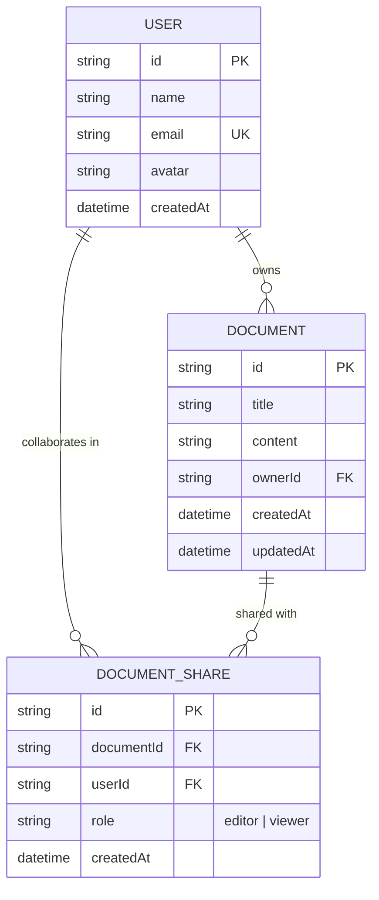
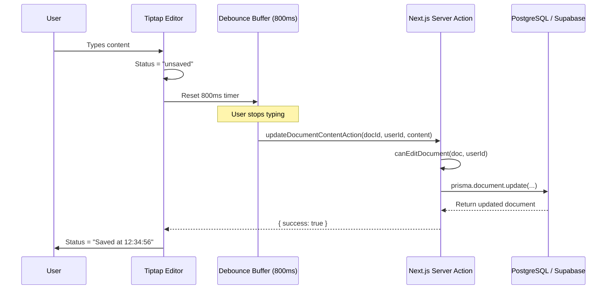

# Architecture & System Design — Ajaia Docs

## 1. System Architecture Overview

Ajaia Docs is structured as a full-stack Next.js application using React Server Components, Client Components for rich interactive editing, Server Actions for transactional mutations, and Prisma ORM connected natively to PostgreSQL / Supabase.

```
┌─────────────────────────────────────────────────────────────────────────┐
│                           Client Presentation                           │
│  ┌────────────────────────┐  ┌──────────────────────────────────────┐   │
│  │   Dashboard & Persona  │  │   Tiptap Document Canvas & Toolbar   │   │
│  │     User Switcher      │  │   (Debounced Autosave, Format Tools) │   │
│  └───────────┬────────────┘  └──────────────────┬───────────────────┘   │
└──────────────┼──────────────────────────────────┼───────────────────────┘
               │                                  │
               ▼                                  ▼
┌─────────────────────────────────────────────────────────────────────────┐
│                      Application & Business Logic Layer                 │
│  ┌───────────────────────────────────────────────────────────────────┐  │
│  │  Access Control Layer: checkDocumentAccess()                      │  │
│  │  - Role Verification: Owner / Editor / Viewer                     │  │
│  │  - Unauthorized Guard (403 Forbidden Response)                    │  │
│  └───────────────────────────────────┬───────────────────────────────┘  │
│                                      │                                  │
│  ┌───────────────────────────────────┴───────────────────────────────┐  │
│  │  Server Actions & Data Adapters                                   │  │
│  │  - createDocumentAction, updateDocumentContentAction              │  │
│  │  - shareDocumentAction, revokeDocumentShareAction                 │  │
│  │  - importDocumentAction (Markdown & Plaintext Pipeline)           │  │
│  └───────────────────────────────────┬───────────────────────────────┘  │
└──────────────────────────────────────┼──────────────────────────────────┘
                                       │
                                       ▼
┌─────────────────────────────────────────────────────────────────────────┐
│                           Persistence Layer                             │
│  ┌───────────────────────────────────────────────────────────────────┐  │
│  │  Prisma ORM (PostgreSQL Provider)                                 │  │
│  │  - DATABASE_URL (Pooled / Serverless Connection for Vercel)       │  │
│  │  - DIRECT_URL (Direct Connection for Migrations & Schema DDL)     │  │
│  │  - Compatible with Supabase PostgreSQL & Connection Pooler        │  │
│  └───────────────────────────────────────────────────────────────────┘  │
└─────────────────────────────────────────────────────────────────────────┘
```

---

## 2. Data Model & Relationships

The relational model implements a clean separation between users, documents, and sharing relationships:



### Relational Constraints & Indexes:
- `Document.ownerId` references `User.id` with `onDelete: Cascade`.
- `DocumentShare` maintains a composite unique constraint `@@unique([documentId, userId])` to prevent duplicate share entries.
- Foreign key indexes on `Document.ownerId`, `DocumentShare.userId`, and `DocumentShare.documentId` guarantee fast query execution during dashboard loading.

---

## 3. Rich-Text Editor Design (Tiptap / ProseMirror)

### Design Philosophy
Rather than relying on brittle `contenteditable` wrappers or heavy legacy frameworks, Ajaia Docs integrates **Tiptap (v2)**, a headless wrapper around ProseMirror:
1. **Structured Document Model**: Content is stored and emitted as structured, valid HTML / ProseMirror JSON nodes.
2. **Modular Extension Architecture**:
   - `StarterKit`: Paragraphs, Headings (H1-H3), Bold, Italic, Strike, Lists (bulleted/numbered), Blockquotes, Code blocks, and History.
   - `@tiptap/extension-underline`: First-class underline support.
   - `@tiptap/extension-placeholder`: Contextual empty-document hints.
3. **Reactive Toolbar**: Formatting buttons reflect the active selection's state using `editor.isActive(...)` and toggle styles using fluent chain commands (`editor.chain().focus().toggleBold().run()`).

---

## 4. Persistence & Autosave Approach

### Debounced Synchronization Flow
1. User types in the editor.
2. Editor `onUpdate` listener sets status to `unsaved` and initiates an **800ms debounce timer**.
3. If user continues typing, previous timers are cancelled.
4. When typing pauses for 800ms, `updateDocumentContentAction` sends the document delta to the server.
5. Save indicator transitions: `Saving...` -> `Saved at HH:MM:SS`.
6. User can trigger an immediate manual flush via `Ctrl+S` / `Cmd+S`.



---

## 5. Sharing & Access Control Architecture

Access logic is encapsulated in pure, unit-tested functions in `src/lib/access.ts`:

```typescript
export function checkDocumentAccess(doc: DocumentWithShares, userId: string): AccessCheckResult
```

### Access Decision Matrix:
| Persona / Requestor | Relationship | Granted Permission | HTTP Status / UI View |
|---|---|---|---|
| **Document Creator** | `doc.ownerId === userId` | Full Owner (`view`, `edit`, `rename`, `delete`, `share`) | `200 OK` (Full Editor Canvas) |
| **Shared Editor** | `share.role === 'editor'` | Collaborator (`view`, `edit`) | `200 OK` (Collaborator Banner) |
| **Shared Viewer** | `share.role === 'viewer'` | Read-Only (`view`) | `200 OK` (Read-Only Mode) |
| **Unrelated User** | Not owner & not in shares | None | `403 Forbidden` (`AccessDenied` View) |
| **Missing Document** | Document does not exist | None | `404 Not Found` |

---

## 6. File Import & Export Approach

### Import Pipeline
1. **User Action**: Drops or uploads `.md` or `.txt` file into `ImportModal`.
2. **Client Validation**: Verifies file extension against supported list (`.txt`, `.md`, `.markdown`).
3. **Parsing (`src/lib/import-export.ts`)**:
   - **Markdown**: `marked.parse` converts markdown formatting, code blocks, lists, and quotes into semantic HTML. If the first line is `# Document Title`, it is extracted as the document title.
   - **Plain Text**: Splits on double newlines and generates `<p>` tags with HTML entity escaping (`&`, `<`, `>`).
4. **Server Creation**: Creates a new document assigned to the current active user and redirects directly to the document editor view.

### Export Pipeline
- Client-side blob serialization into `.md` (Markdown format), `.txt` (Plain text extraction), or `.html` (Self-contained standalone HTML document).

---

## 7. Production Database & Serverless Tradeoffs

1. **Native PostgreSQL / Supabase vs SQLite**:
   - *Decision*: Configured Prisma natively for PostgreSQL using `DATABASE_URL` (pooled for serverless execution) and `DIRECT_URL` (for migrations).
   - *Rationale*: Eliminates Vercel Lambda ephemeral disk data loss and provides true durable multi-region persistence.
2. **Seeded Demo Personas vs Complex Auth**:
   - *Decision*: Implemented cookie/localStorage-backed persona switcher (Alice, Bob, Charlie).
   - *Rationale*: Evaluator time is optimized for verifying sharing workflows and access control rather than password resets or email verification.
3. **Debounced Cloud Autosave vs WebSocket CRDT Real-time**:
   - *Decision*: Robust HTTP debounced autosave with optimistic UI states.
   - *Rationale*: Real-time CRDT (Yjs/ShareDB) adds distributed race condition risks and server infrastructure overhead exceeding the 4-hour assessment boundary without adding core MVP value.
